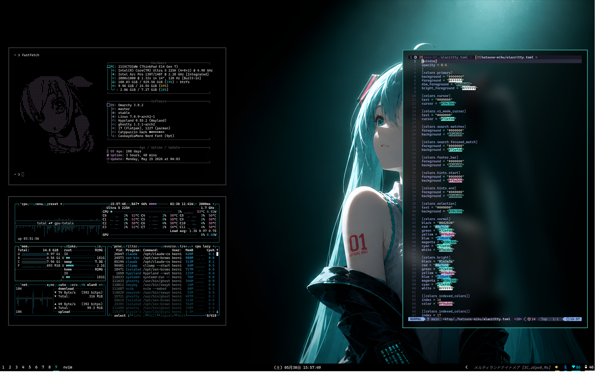
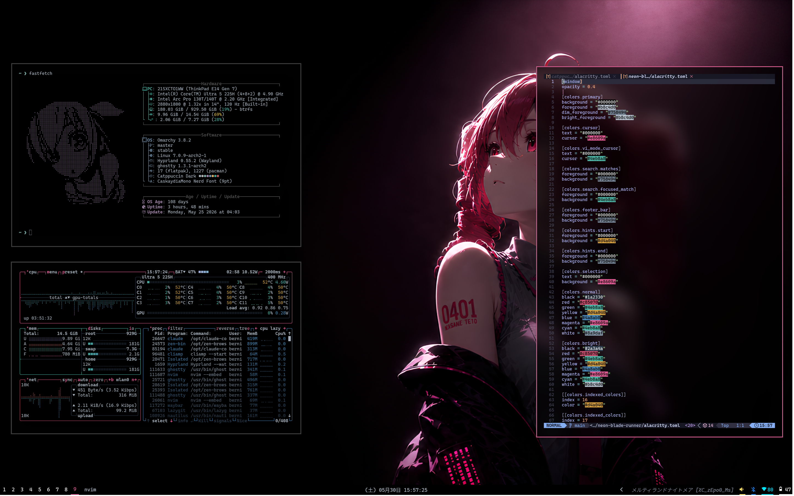
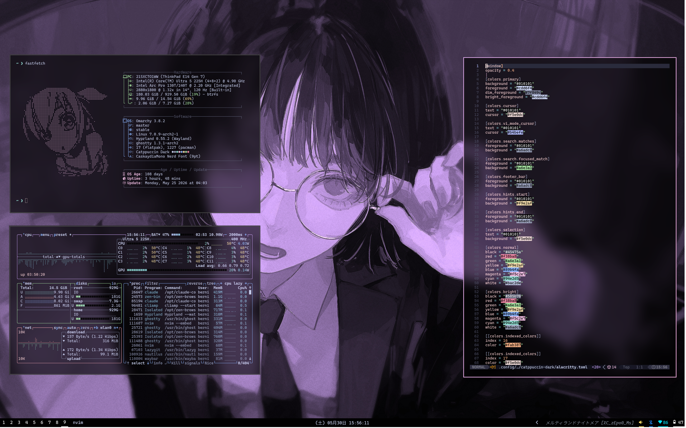

# Darkpuccin Omarchy Dotfiles

Personal dotfiles for [Omarchy](https://omarchy.org/) — an opinionated Arch Linux setup built on Hyprland.

Includes custom themes, hyprland config, waybar, walker, and more.

---

## Themes

### Hatsune Miku
Teal and cyan aesthetic inspired by the virtual idol herself.



**Install:**
```bash
omarchy theme set "Hatsune Miku"
```

---

### Neon Blade Runner
Hot pink and magenta neon vibes. Dark cyberpunk atmosphere.



**Install:**
```bash
omarchy theme set "Neon Blade Runner"
```

---

### Catppuccin Dark
Deep purple Catppuccin Mocha palette with a darker twist.



**Install:**
```bash
omarchy theme set "Catppuccin Dark"
```

---

## Setup

Requires [Omarchy](https://omarchy.org/) to be installed first.

```bash
git clone https://github.com/bernixtersuper/Darkpuccin-Omarchy-Dotfiles.git ~/dotfiles
cd ~/dotfiles
./install.sh
```

The install script syncs `.config/`, `.local/`, and `.bashrc` to your home directory, rebuilds the font cache, and marks omarchy bin scripts as executable. Each section prompts before copying so you can skip what you don't need.

After installing, apply a theme:

```bash
omarchy theme set "Catppuccin Dark"
```

---

## Scripts

### Condensed Mode (`omarchy-hyprland-window-condensed-toggle`)

Toggles a compact window layout: removes all gaps and hides borders on single-window workspaces. Useful for focused work or small screens.

This is a [pending PR](https://github.com/basecamp/omarchy/pulls) not yet merged into official Omarchy. The install script patches it in automatically.

**Toggle via keybind** — add to `~/.config/hypr/bindings.conf`:

```
bind = $mod, C, exec, omarchy-hyprland-window-condensed-toggle
```

Or run directly:

```bash
omarchy-hyprland-window-condensed-toggle
```

---

## System

- **OS:** Arch Linux via Omarchy
- **WM:** Hyprland (Wayland)
- **Bar:** Waybar
- **Launcher:** Walker
- **Terminal:** Ghostty
- **Font:** CaskaydiaMono Nerd Font
