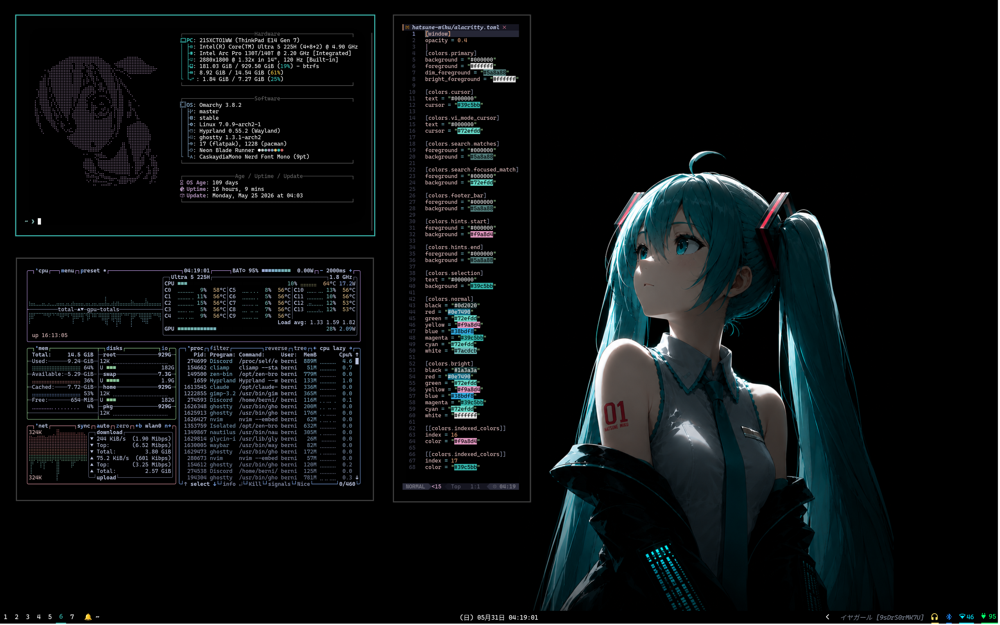
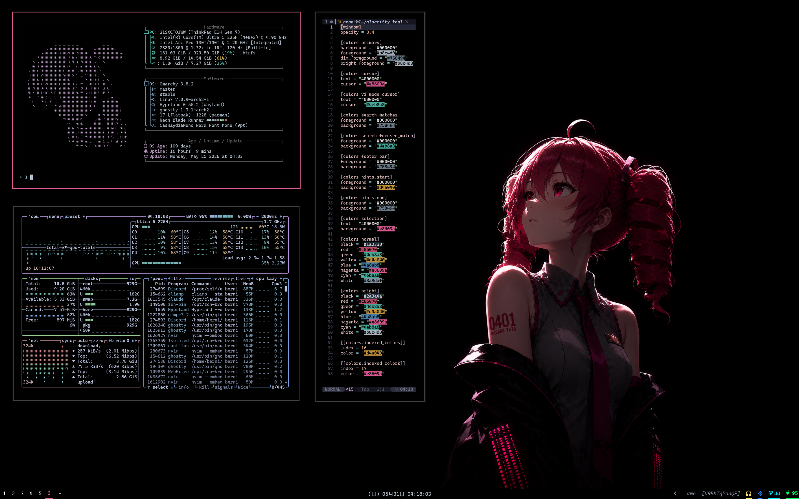
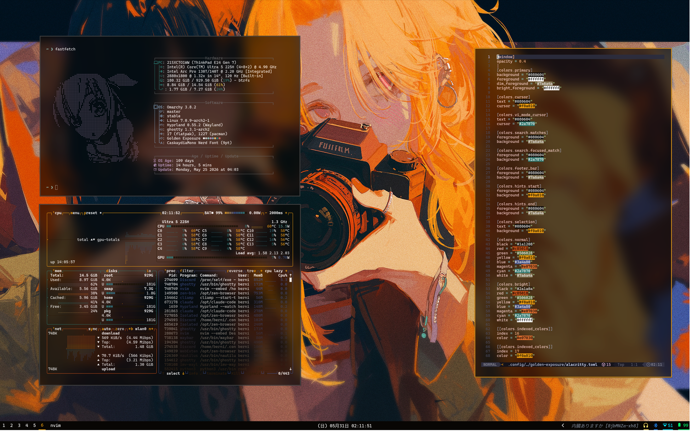

# Darkpuccin Omarchy Dotfiles

Personal dotfiles for [Omarchy](https://omarchy.org/) — an opinionated Arch Linux setup built on Hyprland.

Includes custom themes, hyprland config, waybar, walker, and more.

---

## Themes

### Hatsune Miku
Teal and cyan aesthetic inspired by the virtual idol herself.



**Install:**
```bash
omarchy theme set "Hatsune Miku"
```

---

### Neon Blade Runner
Hot pink and magenta neon vibes. Dark cyberpunk atmosphere.



**Install:**
```bash
omarchy theme set "Neon Blade Runner"
```

---

### Catppuccin Dark
Deep purple Catppuccin Mocha palette with a darker twist.


**Install:**
```bash
omarchy theme set "Catppuccin Dark"
```

---

### Golden Exposure
Warm amber and gold tones. Film photography aesthetic.



**Install:**
```bash
omarchy theme set "golden-exposure"
```

---

## Setup

Requires [Omarchy](https://omarchy.org/) to be installed first.

```bash
git clone https://github.com/bernixtersuper/Darkpuccin-Omarchy-Dotfiles.git ~/dotfiles
cd ~/dotfiles
./install.sh
```

The install script syncs `.config/` (includes all themes), `.local/` (fonts, qalculate data), and `.bashrc` to your home directory, then rebuilds the font cache. Each section prompts before copying so you can skip what you don't need.

After installing, apply a theme:

```bash
omarchy theme set "Catppuccin Dark"
```

### Copying to a different machine

Some configs are hardware-specific and should be skipped when installing on a new PC. Use `--skip` to exclude them:

```bash
./install.sh --skip .config/hypr/monitors.conf \
             --skip .config/hypr/scripts/set-monitor-transform.sh
```

Then write a fresh `~/.config/hypr/monitors.conf` for the PC's actual monitors. Run with `--dry-run` first to preview what would change.

Files skipped above and why:
- `monitors.conf` — hardcodes laptop monitor names, resolutions and positions
- `set-monitor-transform.sh` — hardcodes native resolutions per monitor name

**keyd** also needs manual setup on the new machine. Configs are in `keyd/` in this repo but live in `/etc/keyd/` and require sudo to install:

```bash
sudo cp keyd/keyboard.conf /etc/keyd/keyboard.conf
sudo keyd reload
# ThinkPad only:
sudo cp keyd/thinkpad.conf /etc/keyd/thinkpad.conf
sudo keyd reload
```

- `keyboard.conf` — CapsLock-as-nav-modifier layer (Caps+HJKL = arrows, Caps+;/' = PgUp/PgDn, etc.)
- `thinkpad.conf` — ThinkPad media button remapping (`17aa:5054`)

---

## Scripts

### Dense Mode (`toggle-dense.sh`)

Toggles a dense window layout: zero gaps, no border on single-window workspaces, no shadow. Useful for focused work or small screens.

**Keybind:** `SUPER SHIFT BACKSPACE`

---

### Screen Rotation (`set-monitor-transform.sh`)

Rotates a named monitor to a given transform while preserving its current x/y position (reads from `hyprctl monitors -j` before applying).

```bash
~/.config/hypr/scripts/set-monitor-transform.sh <monitor> <transform>
# transform: 0=normal, 1=90 CCW, 2=180, 3=90 CW
```

Keybinds for eDP-1 (laptop screen):

| Key | Action |
|-----|--------|
| `SUPER [` | Normal |
| `SUPER ]` | Flipped 180 |
| `SUPER SHIFT [` | Rotate left 90 |
| `SUPER SHIFT ]` | Rotate right 90 |

---

### Monitor Resume Fix (`fix-monitors-on-resume.sh`)

Re-applies all connected monitors' current transforms after wake from sleep to fix position drift. Runs automatically on resume via `hypridle.conf` and on boot via `autostart.conf`.

```bash
~/.config/hypr/scripts/fix-monitors-on-resume.sh
```

---

## System

- **OS:** Arch Linux via Omarchy
- **WM:** Hyprland (Wayland)
- **Bar:** Waybar
- **Launcher:** Walker
- **Terminal:** Ghostty
- **Font:** CaskaydiaMono Nerd Font
